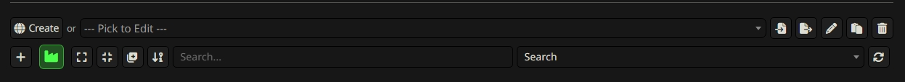
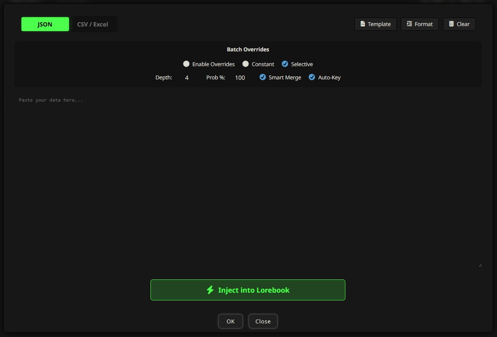

# 🏭 SillyTavern LoreFactory

Repository: [https://github.com/QuigleyDown/SillyTavern_LoreFactory](https://github.com/QuigleyDown/SillyTavern_LoreFactory)

**LoreFactory** is a powerful batch-import tool for SillyTavern that allows you to inject dozens of lorebook entries at once using JSON or CSV data. It is integrated directly into the World Info editor for a seamless workflow.

## 🚀 Features

- **Multi-Format Support:** Toggle between **JSON** and **CSV / Excel** input modes.
- **Smart Merge:** Automatically updates existing entries if the Title (Comment) matches, preventing duplicates.
- **Batch Overrides:** Force settings like `Constant`, `Selective`, `Depth`, and `Probability` across all imported entries.
- **Auto-Key Generation:** Automatically uses the Entry Title as a trigger keyword if the keyword field is left empty.
- **Live Preview:** See a real-time list of detected entries as you type or paste data.
- **JSON Formatting:** Built-in "Format" tool to beautify and validate your raw JSON.
- **Native UI:** Designed to match your SillyTavern theme with a high-contrast, professional layout.

## 🛠️ How to Use

### 1. Opening LoreFactory
1. Open the **World Info** (Lorebook) panel in SillyTavern.
2. Select the Lorebook you want to edit from the dropdown.
3. Click the **Bright Green Factory Icon** (🏭) next to the "New Entry (+)" button.

### 2. Importing Data

#### **JSON Mode**
Paste an array of objects or a single object. 
- **Supported Fields:** `comment` (or `title`/`name`), `content` (or `text`/`description`), `key` (or `keywords`), `keysecondary` (or `secondary_keys`).
- Use the **Template** button to see a valid example.
- Use the **Format** button to fix indentation.

#### **CSV Mode**
Paste raw CSV data (comma-separated). The first line must be the header.
- **Example Header:** `Title,Keywords,Content`
- **Tips:** You can copy-paste directly from Excel or Google Sheets. The parser handles quotes and commas within fields.

### 3. Using Batch Overrides
If you have a specific requirement for the entire batch (e.g., "I want all these entries to have Depth 10"):
1. Check **Enable Overrides**.
2. Set your desired values (Const, Select, Depth, Prob %).
3. LoreFactory will ignore the values in your source data and force these settings onto every imported entry.

### 4. Injecting
Once the **Live Preview** shows the correct count of entries, click **Inject into Lorebook**.
- Entries will appear immediately in the editor.
- If **Smart Merge** is enabled, existing entries with the same title will be updated in-place.

## 📦 Installation

### The Easy Way (SillyTavern Installer)
1. Open **SillyTavern Settings** ( Extensions).
2. Go to the **Install Third-Party Extension** section.
3. Paste the URL of this GitHub repository into the text box.
4. Click **Install**.

### The Manual Way
1. Copy the `SillyTavern_LoreFactory` folder into your SillyTavern `public/scripts/extensions/third-party/` directory.
2. Restart SillyTavern or reload the browser.
3. Ensure "Third Party Extensions" are enabled in SillyTavern settings.

---